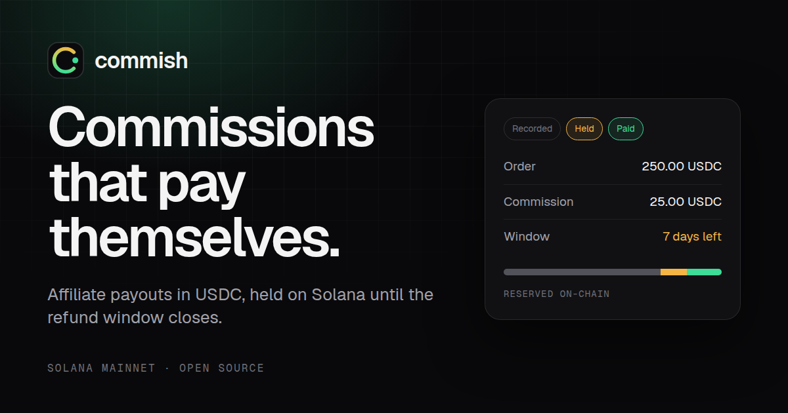
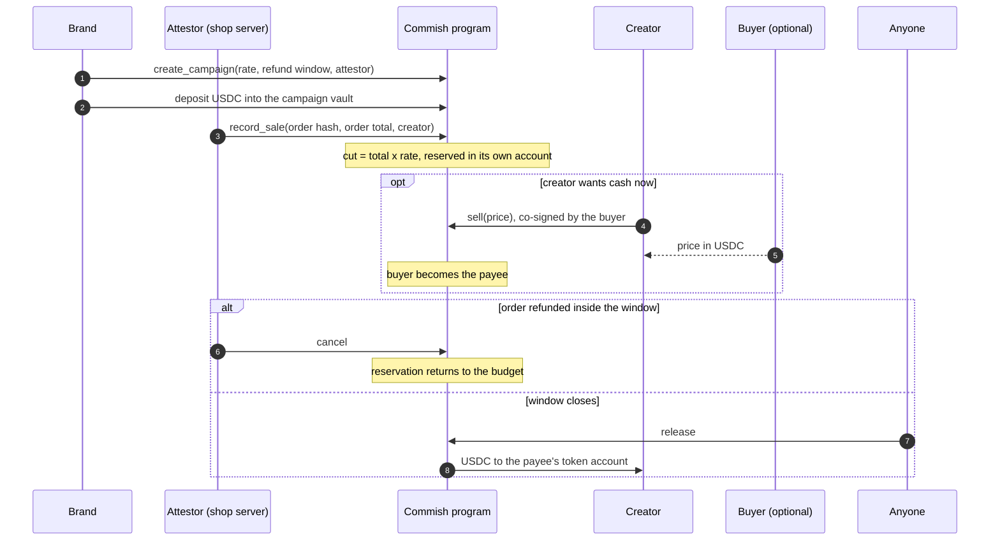
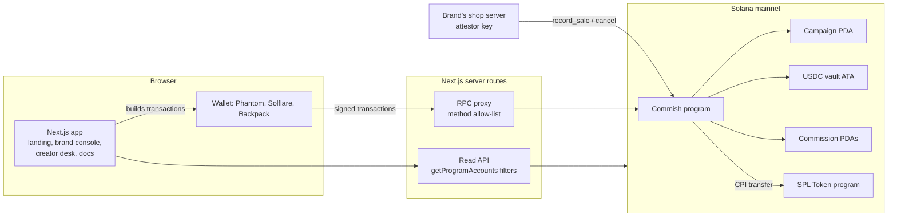

<p align="center">
  
</p>

# Commish: Affiliate Commissions That Pay Themselves

> **Affiliate commissions held in USDC on Solana until the refund window closes, then paid out by anyone, to the creator only. A creator who cannot wait sells the pending commission for cash today.**

[](https://explorer.solana.com/address/CmSHpw9QTwvRSNCCBrQz275ESTCw8D79Z8jjhWmPJfFB)
[](https://getcommish.vercel.app)
[](https://github.com/anza-xyz/pinocchio)
[](#the-program)
[](#guarantees-and-the-tests-that-attack-them)
[](https://explorer.solana.com/address/EPjFWdd5AufqSSqeM2qN1xzybapC8G4wEGGkZwyTDt1v)
[](LICENSE)
[](https://www.colosseum.org)

---

| | |
|---|---|
| **Live app** | [getcommish.vercel.app](https://getcommish.vercel.app) (English, Bahasa Indonesia, Español, 中文; light and dark) |
| **Docs** | [getcommish.vercel.app/en/docs](https://getcommish.vercel.app/en/docs) |
| **Program (mainnet)** | [`CmSHpw9QTwvRSNCCBrQz275ESTCw8D79Z8jjhWmPJfFB`](https://explorer.solana.com/address/CmSHpw9QTwvRSNCCBrQz275ESTCw8D79Z8jjhWmPJfFB) |
| **Deploy transaction** | [`vZRdesXg…2xWPk9Cv6`](https://explorer.solana.com/tx/vZRdesXgmPhV15JwAHy5akzcsn5AWssFYGne5mCcbEcDqJufqxwZWzwSUXHbUoNKBEzaMaryR1h2kB2xWPk9Cv6) |
| **Upgrade authority** | [`ETcQvsQek2w9feLfsqoe4AypCWfnrSwQiv3djqocaP2m`](https://explorer.solana.com/address/ETcQvsQek2w9feLfsqoe4AypCWfnrSwQiv3djqocaP2m) (founder wallet) |
| **Settlement token** | USDC [`EPjFWdd5AufqSSqeM2qN1xzybapC8G4wEGGkZwyTDt1v`](https://explorer.solana.com/address/EPjFWdd5AufqSSqeM2qN1xzybapC8G4wEGGkZwyTDt1v) |
| **Pitch deck** | [PDF](pitch/commish-pitch.pdf) · [PowerPoint](pitch/commish-pitch.pptx) · [editable PowerPoint](pitch/commish-pitch-editable.pptx) |
| **Videos** | [Launch video, 23 s](brag-output/brag.mp4) · [Product walkthrough](docs/video/commish-walkthrough.mp4) |
| **Repository** | [github.com/bryankwandou/commish](https://github.com/bryankwandou/commish) |

---

## Production Status

| Status | What it means |
|--------|---------------|
| **LIVE ON MAINNET** | The program runs on Solana mainnet-beta; deploy cost 0.04901 SOL |
| **NON-CUSTODIAL** | Funds sit in program-owned vaults. No server, and not the Commish team, can move them |
| **NO BACKEND KEYS** | The website holds no private key. Every transaction is signed in the user's wallet |
| **WORKS WITHOUT THE WEBSITE** | `release` needs no signer, so a due commission can be paid from any Solana client |
| **ATTACK-TESTED** | 28 tests attack the compiled binary; a 41-check lifecycle run passed on a local validator configured like mainnet |
| **REVIEWED** | Internal security review in [`docs/security-review.md`](docs/security-review.md); the one medium finding is fixed |
| **MULTILINGUAL** | English, Bahasa Indonesia, Español, 中文; light and dark themes; phone-first layout |

---

# ENGLISH

## Table of Contents

1. [What Is Commish?](#what-is-commish)
2. [The Problem](#the-problem)
3. [The Solution](#the-solution)
4. [How It Works, End to End](#how-it-works-end-to-end)
5. [System Architecture](#system-architecture)
6. [Key Features](#key-features)
7. [Early Payout](#early-payout)
8. [The Program](#the-program)
9. [Guarantees and the Tests That Attack Them](#guarantees-and-the-tests-that-attack-them)
10. [On-Chain Proof](#on-chain-proof)
11. [Business Model](#business-model)
12. [Tech Stack](#tech-stack)
13. [Quick Start](#quick-start)
14. [Environment Variables](#environment-variables)
15. [Integration Guide for Brands](#integration-guide-for-brands)
16. [Security Model](#security-model)
17. [Repository Layout](#repository-layout)
18. [Roadmap](#roadmap)
19. [Team](#team)
20. [Media and Credits](#media-and-credits)
21. [License](#license)

---

## What Is Commish?

Commish is an escrow protocol for affiliate commissions. A brand locks a USDC
budget in a campaign vault. Each sale a creator refers reserves that creator's
cut in its own on-chain account, where the brand can no longer spend it. When
the refund window closes, anyone can trigger the payout, and it can only land
in the creator's token account.

Brands keep the refund window they already use. Creators get something they
never had: a public, binding promise that the money exists and will be paid on
a known date. A creator who does not want to wait can sell that promise to a
buyer for cash today.

The whole protocol is one Pinocchio program of **9,296 bytes**, deployed to
Solana mainnet for **0.04901 SOL**.

---

## The Problem

<p align="center"></p>

**1. Creators are paid on the brand's schedule.** Amazon Associates pays
commission "approximately 60 days after the end of the month" in which it was
earned ([S1](research/commish-sources.md)). A sale on January 2 becomes money
around the end of March.

**2. The hold exists for a good reason.** About **19.3% of US online sales**
were expected to be returned in 2025 ([S2](research/commish-sources.md)). No
brand wants to pay commission on a refunded order, so holding commission until
the refund window closes is fair.

**3. What is missing is a guarantee.** During the hold, the money is still the
brand's. Programs change terms, shut down, or fall behind, and the creator has
no independent record of what they are owed. Among affiliates in high-risk
verticals, 73% name payout reliability as their main reason to switch programs
([S8](research/commish-sources.md), secondary source).

**4. Instant payouts do not work.** At least eight earlier Solana affiliate or
referral projects entered Colosseum hackathons, and none placed
([S7](research/commish-sources.md)). Several promised instant payouts, which
ignores returns: a brand cannot pay out on an order that may still be refunded.

**Market.** US brands are forecast to spend **$13.81B** on affiliate marketing
in 2026 ([S3](research/commish-sources.md), secondary source), and there are
about **50 million** creators worldwide ([S4](research/commish-sources.md)).

---

## The Solution

Commish changes one thing: **the moment a sale is recorded, the commission
stops belonging to the brand.**

| | Today | With Commish |
|---|---|---|
| Where the commission sits during the hold | The brand's bank account | A program-owned USDC vault, reserved per order |
| Can the brand spend it during the hold? | Yes | No. `withdraw` only moves the unreserved balance |
| Refund inside the window | Brand adjusts a spreadsheet | Attestor calls `cancel`; the reservation returns to the budget |
| Who can trigger the payout | Only the brand | Anyone, once the window closes |
| Where the payout can go | Wherever the brand sends it | Only the payee's own USDC account for the campaign's mint |
| If the platform disappears | The creator chases the brand | The creator calls `release` from any Solana client |
| Need the money early | Wait | Sell the pending commission in one transaction |
| Cross-border cost | Wire and FX fees, payout minimums | A Solana base fee of 5,000 lamports per signature ([S6](research/commish-sources.md)) |

Commish does not try to prove that an off-chain sale happened; nothing on-chain
can. The brand's attestor reports sales. What Commish guarantees is everything
after that report.

---

## How It Works, End to End

<p align="center"></p>



1. **Fund.** The brand creates a campaign with a commission rate (up to 50%), a
   refund window (0 to 90 days) and an attestor key, then deposits USDC into a
   vault owned by the campaign address.
2. **Record.** When a referred order is paid, the brand's attestor calls
   `record_sale` with a hash of the order, the order total and the creator's
   wallet. The program computes the cut from the campaign rate and refuses the
   sale if the unreserved budget cannot cover it.
3. **Hold.** Inside the refund window the attestor can `cancel` the commission
   if the order is refunded. The brand can withdraw everything except what is
   reserved.
4. **Release.** After the window, anyone can call `release`. The USDC goes to
   the current payee's token account, the commission account closes, and its
   rent returns to whoever paid it.

### State of one commission

| | |
| --- | --- |
|  | **Held.** 25.00 USDC reserved from a 250.00 USDC order at 10%; the brand cannot withdraw it. |
|  | **Sold early.** The creator receives 24.25 USDC now; the buyer is the payee. |
|  | **Paid.** Released when the window closed; the account is closed and its rent refunded. |

---

## System Architecture



- **The program is the source of truth.** There is no database. Every balance,
  reservation and commission shown in the app is read from program accounts.
- **The server never signs.** Server routes only read chain state and forward
  a fixed list of JSON-RPC methods for the browser.
- **The attestor is the brand's own key.** It lives on the brand's shop
  server, not on Commish infrastructure. For small shops, the brand console
  can act as the attestor from a connected wallet.

---

## Key Features

<p align="center"></p>

| | |
| --- | --- |
|  |  |
| **Brand console** (`/brand`). Create and fund campaigns, record sales, refund inside the window, withdraw what is unreserved, share the campaign link. | **Docs** (`/docs`). Accounts, instructions, error codes, integration steps and the security model. |
|  |  |
| **Four languages, two themes.** | **Phone-first layout.** |

- **Creator desk** (`/creator`): every commission a wallet is owed across all
  campaigns, what is pending and what is due, one-click release, early payout,
  and a referral-link builder.
- **Campaign page** (`/campaign/<address>`): a public, read-only view of a
  campaign's budget, reservations and open commissions. A creator can check a
  brand's budget before promoting it.
- **Integration** (`/docs#integration`): a TypeScript client with account
  decoders, PDA derivation and a builder for every instruction.

<p align="center"></p>

---

## Early Payout

<p align="center"></p>

A pending commission is money owed on a known date, so it can be sold.

- The payee and a buyer both sign `sell` with an agreed price.
- The price is paid in the campaign's token and can never exceed the
  commission's face value.
- The buyer becomes the payee and collects the full amount at release.
- The buyer also takes over the refund risk: if the order is refunded inside
  the window, the commission is cancelled and the buyer receives nothing. The
  discount prices that risk.
- It settles in one transaction; neither side has to trust the other.

Worked example: a 25.00 USDC commission due in 30 days, sold at a 3% discount.
The creator receives **24.25 USDC today**. The buyer receives **25.00 USDC** at
release.

---

## The Program

Written with [Pinocchio](https://github.com/anza-xyz/pinocchio) 0.11: no
Anchor, no heap allocation, no serialization library. Source:
[`program/src/lib.rs`](program/src/lib.rs), 516 lines.

### Size and deploy cost

Mainnet rent is `(bytes + 128) × 5,080` lamports.

| Account | Bytes | Rent (SOL) |
| --- | ---: | ---: |
| Program data (binary + 45-byte header) | 9,341 | 0.04810252 |
| Program account | 36 | 0.00083312 |
| **Total held by the deploy** | | **0.04893564** |

The first working build was 25,664 bytes (about 0.13 SOL to deploy). It shrank
to 9,296 bytes without removing a feature or a check:

- `core` rebuilt with `panic_immediate_abort`, `opt-level = 3`, fat LTO.
- Zero-copy `#[repr(C)]` records read in place.
- A hand-written lazy entrypoint that reads at most 7 accounts, and one CPI
  helper shared by every token transfer.
- The client passes PDA bumps and rent amounts. The program re-derives each
  PDA with the given bump and compares it; the runtime rejects an account
  below the rent-exempt minimum.
- Checked arithmetic where an input can overflow; invariant-based arithmetic
  only where the invariant is enforced on the way in.

The 28 tests run against this exact build, so the size work is tested, not
assumed.

### Accounts

| Account | Seeds | Size | Holds |
| --- | --- | ---: | --- |
| Campaign | `["campaign", brand, id_le]` | 176 | brand, attestor, mint, vault, id, hold, reserved, paid, bps |
| Commission | `["commission", campaign, order_hash]` | 184 | campaign, creator, payee, rent payer, order hash, amount, release time, sold flag |
| Vault | associated token account of the campaign | 165 | the campaign's USDC |

### Instructions and compute units

| # | Instruction | Signers | What it checks | Compute units |
| ---: | --- | --- | --- | ---: |
| 0 | `create_campaign` | brand | rate ≤ 5,000 bps, hold ≤ 90 days, vault is the campaign's ATA | 15,109 (with the vault) |
| 1 | `record_sale` | attestor, payer | signer is the campaign attestor, commission > 0, `reserved + cut ≤ vault balance` | 1,783 |
| 2 | `cancel` | attestor | before `release_at` | 376 |
| 3 | `release` | none | after `release_at`, destination owned by the payee and holding the campaign mint, commission belongs to this campaign; 1% goes to the treasury's token account | 2,947 |
| 4 | `withdraw` | brand | `reserved + amount ≤ vault balance` | 1,450 |
| 5 | `sell` | payee, buyer | before `release_at`, price ≤ face value, token accounts on the campaign mint | 1,622 |

### Order hash

The commission address is a PDA of the order hash, so one order can only ever
be recorded once.

```
order_hash = HMAC-SHA256(key, "commish:v1" || campaign || order_id)
```

The key is known only to the brand: its shop secret, or a key the brand
console derives from a wallet signature. Without it, nobody can compute the
address of a future order and create it first to block the sale. See finding 1
in the [security review](docs/security-review.md).

### Error codes

| Code | Name | Code | Name |
| ---: | --- | ---: | --- |
| 6000 | InvalidInstruction | 6009 | ZeroCommission |
| 6001 | NotEnoughAccounts | 6010 | InsufficientBudget |
| 6002 | MissingSigner | 6011 | StillHeld |
| 6003 | InvalidAccount | 6012 | AlreadyDue |
| 6004 | WrongAttestor | 6013 | NotPayee |
| 6005 | WrongBrand | 6014 | InvalidPrice |
| 6006 | WrongAccount | 6015 | Overflow |
| 6007 | InvalidCommission | 6016 | TooManyAccounts |
| 6008 | InvalidHold | 6017 | Runtime |

---

## Guarantees and the Tests That Attack Them

Every rule is enforced by the program and attacked by a test in
[`program/test/commish.test.ts`](program/test/commish.test.ts), which loads
the compiled `.so` into LiteSVM.

| Guarantee | How the program enforces it | Test |
| --- | --- | --- |
| Owed money stays locked | `withdraw` requires `reserved + amount ≤ vault balance` | the brand can take back only what is not reserved |
| One order, one commission | the commission address is a PDA of the order hash | the same order can never be recorded twice |
| Only the attestor records sales | the signer must equal `campaign.attestor`; the amount comes from `campaign.bps` | only the campaign's attestor can record a sale |
| No overspending | a sale needs `reserved + cut ≤ vault balance` | a sale cannot reserve more than the unreserved budget |
| Payouts cannot be redirected | the destination's owner must be the payee and its mint the campaign mint | the payout cannot be redirected |
| No cross-campaign drains | the commission must belong to the campaign whose vault pays | a commission from another campaign cannot drain this vault |
| Paid exactly once | the commission account is closed in the instruction that pays it | a commission cannot be paid twice |
| No cancelling after the window | `cancel` requires `now < release_at` | once the window has closed the commission is owed and cannot be cancelled |
| Rent goes back to its payer | the rent destination must equal `commission.rent_payer` | the rent goes back to whoever paid it, nobody else |
| Works without this website | `release` needs no signer | pays the creator once the refund window closes, and refunds the rent |

A second, independent check: [`web/scripts/lifecycle.mts`](web/scripts/lifecycle.mts)
drives the full lifecycle through the app's own client against a local
validator with mainnet's feature set, and passed **42 of 42** checks, including the 1% fee
([`docs/proof/live-validator-run.md`](docs/proof/live-validator-run.md)).

---

## On-Chain Proof

| What | Link |
| --- | --- |
| Program account | [CmSHpw9Q…w8D79Z8jjhWmPJfFB](https://explorer.solana.com/address/CmSHpw9QTwvRSNCCBrQz275ESTCw8D79Z8jjhWmPJfFB) |
| Deploy transaction | [vZRdesXg…2xWPk9Cv6](https://explorer.solana.com/tx/vZRdesXgmPhV15JwAHy5akzcsn5AWssFYGne5mCcbEcDqJufqxwZWzwSUXHbUoNKBEzaMaryR1h2kB2xWPk9Cv6) |
| Upgrade authority | [ETcQvsQe…djqocaP2m](https://explorer.solana.com/address/ETcQvsQek2w9feLfsqoe4AypCWfnrSwQiv3djqocaP2m), the founder's wallet |
| Deployed binary hash | `sha256 3e71be49df0861a5ff1343e6dbf0a28674d363c830b32d226fca16328cc264c4` (9,296 bytes) |

To verify the binary yourself:

```bash
solana program dump CmSHpw9QTwvRSNCCBrQz275ESTCw8D79Z8jjhWmPJfFB onchain.so -u m
head -c 9296 onchain.so | sha256sum
cd program && npm run build && sha256sum target/deploy/commish.so
```

---

## Business Model

- **Fee:** 1% of each payout, taken at release and sent to the treasury's USDC
  account. It is enforced in the program source (`FEE_BPS = 100`) and covered by
  two tests and the lifecycle run; it goes live on mainnet with the next program
  upgrade.
- **Size of the prize:** if 1% of US affiliate spend settled through Commish,
  that is about $138M a year in volume and about **$1.4M a year** in fees.
- **Early payout:** a market for pending commissions. Buyers earn the discount;
  a protocol fee on sales is a later option.
- **First users:** Solana apps that already pay creators and referrers in
  USDC, where the wallet, the token and the audience are already on-chain.

---

## Tech Stack

| Layer | Technology |
| --- | --- |
| On-chain program | Rust, Pinocchio 0.11, SBPF v0, `cargo build-sbf` with `-Zbuild-std=core` |
| Program tests | LiteSVM, TypeScript |
| Token | SPL Token (legacy program), USDC |
| Web app | Next.js (App Router), React, TypeScript, Tailwind CSS |
| Wallets | Solana Wallet Adapter (Phantom, Solflare, Backpack and any Wallet Standard wallet) |
| Client | `@solana/kit`, hand-written decoders and instruction builders |
| i18n | English, Bahasa Indonesia, Español, 中文 |
| Hosting | Vercel |
| Pitch and media | Plinth (deck), PptxGenJS (PowerPoint), Playwright and ffmpeg (videos) |

---

## Quick Start

Program (needs the Solana CLI with `cargo build-sbf`):

```bash
cd program
npm ci
npm run build   # target/deploy/commish.so, 9,296 bytes
npm test        # 28 tests against the compiled binary
```

App:

```bash
cd web
npm ci
npm run dev     # http://localhost:3000
```

Full lifecycle on a local validator with mainnet's feature set (SIMD-0500
turned off, as on mainnet):

```bash
solana-test-validator --reset \
  --deactivate-feature B8JJXCy5amZyWG9r7EnUYLwzXSXTxG7GZ1qZ1qggo83g
solana program deploy program/target/deploy/commish.so -u l
cd web && RPC_URL=http://127.0.0.1:8899 node --import tsx scripts/lifecycle.mts <payer-keypair.json>
```

---

## Environment Variables

None of these are secrets. The app holds no private keys.

| Variable | Used for | Default |
| --- | --- | --- |
| `RPC_URL` | server-side reads and the RPC proxy | `https://api.mainnet-beta.solana.com` |
| `NEXT_PUBLIC_RPC_URL` | the browser's RPC endpoint | the app's own `/api/rpc` proxy |
| `NEXT_PUBLIC_SITE_URL` | canonical links and share URLs | `https://getcommish.vercel.app` |

---

## Integration Guide for Brands

1. Create a campaign in the brand console: rate, refund window, attestor key.
2. Deposit USDC into the campaign vault.
3. Creators share your product links with `?ref=<their wallet>`. Store the ref
   with the order at checkout.
4. When a referred order is paid, your server computes the keyed order hash
   and sends `record_sale`, signed by the attestor key.
5. If the order is refunded inside the window, send `cancel`.
6. Nothing else. Creators, or anyone, release due commissions.

```ts
import { orderHash, recordSaleIx } from "./lib/commish/program";

const hash = await orderHash(campaign, order.id, SHOP_SECRET);
const { instruction } = await recordSaleIx({
  attestor, payer, campaign, vault,
  orderHash: hash,
  orderAmount: order.totalUsdc, // 6-decimal base units
  creator: order.ref,
  lamports: commissionRent,     // rent-exempt minimum for 184 bytes
});
```

---

## Security Model

- **Trusted:** the brand's attestor reports real, paid orders. The program
  cannot see off-chain orders; it guarantees what happens after one is
  recorded.
- **Funds leave a vault only two ways:** `release` (to the payee, after the
  window) and `withdraw` (the unreserved part, to the brand).
- **Token checks:** only the legacy SPL Token program is accepted, and every
  token account is checked against the campaign's mint.
- **Order hashes are keyed,** so nobody can pre-create a commission address to
  block an order.
- **No admin key.** There is no pause switch and no fee account the team
  controls. The upgrade authority is the founder's wallet and will move to a
  multisig before real volume.
- **Review status.** An internal review ([`docs/security-review.md`](docs/security-review.md))
  lists one medium finding (fixed) and three low or informational ones. It is
  not a third-party audit. Keep amounts modest until one is done.

---

## Repository Layout

| Path | What it is |
| --- | --- |
| [`program/`](program) | the on-chain program (`src/lib.rs`) and its LiteSVM test suite |
| [`web/`](web) | the Next.js app: landing, brand console, creator desk, docs, API routes |
| [`web/src/lib/commish/program.ts`](web/src/lib/commish/program.ts) | the client: decoders, PDA derivation, every instruction builder |
| [`web/scripts/`](web/scripts) | lifecycle and griefing checks against a local validator |
| [`docs/`](docs) | screenshots, security review, on-chain proof, video scripts |
| [`pitch/`](pitch) | the pitch deck: PDF, PowerPoint (pixel-exact and editable), HTML source with speaker notes |
| [`research/commish-sources.md`](research/commish-sources.md) | every outside number, with its page and a verbatim quote |
| [`brag-output/`](brag-output) | the 23-second launch video, its poster and share copy |

The directories `programs/`, `pinocchio/`, `app/`, `runbooks/`, `scripts/` and
`tests/` hold the first iteration of this project (Anchor, then an earlier
Pinocchio port). They are superseded by `program/` and `web/` and are not part
of the deployed product.

---

## Roadmap

| When | Milestone |
| --- | --- |
| Sep 2026 | Program on mainnet, app live in four languages, internal security review |
| Oct 2026 | First live campaign with a real shop; Colosseum submission |
| Q4 2026 | Shopify and WooCommerce attestor plugins; upgrade authority to a multisig |
| Q1 2027 | Ten pilots with Solana apps that pay creators; third-party audit |
| 2027 | Secondary market for pending commissions; 1% payout fee switched on |

---

## Team

**Bryan** ([@bryankwandou](https://github.com/bryankwandou)), founder.
Informatics student in Makassar, Indonesia, and lead of the Superteam campus
club. A working creator since 2022 (Objkt, Drip, Shutterstock, Upwork). Built
the program, the app and the tests.

---

## Media and Credits

- **Launch video** (23 s): [`brag-output/brag.mp4`](brag-output/brag.mp4), made from the running app.
- **Product walkthrough**: [`docs/video/commish-walkthrough.mp4`](docs/video/commish-walkthrough.mp4).
- **Pitch deck** (12 slides): [`pitch/commish-pitch.pdf`](pitch/commish-pitch.pdf).

Music: "Happy Beats / Business Moves" Vol. 10 and Vol. 12 by Sascha Ende
([ende.app](https://ende.app/en)), CC BY 4.0. Sound effects by
[Kenney](https://kenney.nl/), CC0. Geist fonts by Vercel, SIL Open Font License.

---

## License

[Apache-2.0](LICENSE)

---
---

# BAHASA INDONESIA

## Daftar Isi

1. [Status Produksi](#status-produksi)
2. [Apa Itu Commish?](#apa-itu-commish)
3. [Masalah](#masalah)
4. [Solusi](#solusi)
5. [Cara Kerja dari Awal sampai Akhir](#cara-kerja-dari-awal-sampai-akhir)
6. [Arsitektur Sistem](#arsitektur-sistem)
7. [Fitur Utama](#fitur-utama)
8. [Pencairan Lebih Awal](#pencairan-lebih-awal)
9. [Program On-Chain](#program-on-chain)
10. [Jaminan dan Tes yang Menyerangnya](#jaminan-dan-tes-yang-menyerangnya)
11. [Bukti On-Chain](#bukti-on-chain)
12. [Model Bisnis](#model-bisnis)
13. [Tech Stack (ID)](#tech-stack-id)
14. [Mulai Cepat](#mulai-cepat)
15. [Variabel Lingkungan](#variabel-lingkungan)
16. [Panduan Integrasi untuk Brand](#panduan-integrasi-untuk-brand)
17. [Model Keamanan](#model-keamanan)
18. [Struktur Repositori](#struktur-repositori)
19. [Roadmap (ID)](#roadmap-id)
20. [Tim](#tim)
21. [Media dan Kredit](#media-dan-kredit)
22. [Lisensi](#lisensi)

---

## Status Produksi

| Status | Artinya |
|--------|---------|
| **LIVE DI MAINNET** | Program berjalan di Solana mainnet-beta; biaya deploy 0,04901 SOL |
| **NON-KUSTODIAL** | Dana ada di vault milik program. Tidak ada server, termasuk tim Commish, yang bisa memindahkannya |
| **TANPA KUNCI DI SERVER** | Website tidak menyimpan private key. Setiap transaksi ditandatangani di wallet pengguna |
| **TETAP JALAN TANPA WEBSITE** | `release` tidak butuh penanda tangan, jadi komisi yang jatuh tempo bisa dibayar dari klien Solana mana pun |
| **DIUJI DENGAN SERANGAN** | 28 tes menyerang binary hasil kompilasi; 41 pemeriksaan siklus penuh lolos di validator lokal dengan fitur mainnet |
| **DITINJAU** | Tinjauan keamanan internal di [`docs/security-review.md`](docs/security-review.md); satu temuan medium sudah diperbaiki |
| **MULTIBAHASA** | English, Bahasa Indonesia, Español, 中文; tema terang dan gelap; tata letak untuk ponsel |

---

## Apa Itu Commish?

Commish adalah protokol escrow untuk komisi afiliasi. Brand mengunci anggaran
USDC di vault kampanye. Setiap penjualan dari kreator mencadangkan bagian
kreator itu di akun on-chain tersendiri, dan brand tidak bisa lagi
memakainya. Saat masa refund berakhir, siapa pun bisa memicu pembayaran, dan
dana hanya bisa masuk ke token account milik kreator.

Brand tetap memakai masa refund yang sudah mereka pakai. Kreator mendapat hal
yang belum pernah mereka punya: janji publik dan mengikat bahwa uangnya ada dan
akan dibayar pada tanggal yang jelas. Kreator yang tidak mau menunggu bisa
menjual janji itu ke pembeli dan menerima uang hari ini.

Seluruh protokol adalah satu program Pinocchio berukuran **9.296 byte**,
di-deploy ke Solana mainnet dengan biaya **0,04901 SOL**.

---

## Masalah

**1. Kreator dibayar sesuai jadwal brand.** Amazon Associates membayar komisi
"sekitar 60 hari setelah akhir bulan" komisi itu didapat
([S1](research/commish-sources.md)). Penjualan tanggal 2 Januari baru jadi uang
sekitar akhir Maret.

**2. Masa tahan itu punya alasan yang sah.** Sekitar **19,3% penjualan online
di AS** diperkirakan dikembalikan pada 2025 ([S2](research/commish-sources.md)).
Tidak ada brand yang mau membayar komisi atas pesanan yang di-refund.

**3. Yang tidak ada adalah jaminan.** Selama masa tahan, uang itu masih milik
brand. Program afiliasi bisa mengubah aturan, tutup, atau telat bayar, dan
kreator tidak punya catatan independen atas haknya. Di kalangan afiliasi
sektor berisiko tinggi, 73% menyebut keandalan pembayaran sebagai alasan utama
pindah program ([S8](research/commish-sources.md), sumber sekunder).

**4. Pembayaran instan tidak berhasil.** Setidaknya delapan proyek afiliasi
atau referral Solana sebelumnya ikut hackathon Colosseum, dan tidak ada yang
juara ([S7](research/commish-sources.md)). Beberapa menjanjikan pembayaran
instan, yang mengabaikan refund.

**Pasar.** Brand di AS diperkirakan membelanjakan **US$13,81 miliar** untuk
pemasaran afiliasi pada 2026 ([S3](research/commish-sources.md), sumber
sekunder), dan ada sekitar **50 juta** kreator di dunia
([S4](research/commish-sources.md)).

---

## Solusi

Commish mengubah satu hal: **begitu penjualan dicatat, komisi itu bukan lagi
milik brand.**

| | Sekarang | Dengan Commish |
|---|---|---|
| Letak komisi selama masa tahan | Rekening bank brand | Vault USDC milik program, dicadangkan per pesanan |
| Bisakah brand memakainya? | Bisa | Tidak. `withdraw` hanya memindahkan saldo yang tidak dicadangkan |
| Refund di dalam masa refund | Brand mengubah spreadsheet | Attestor memanggil `cancel`; cadangan kembali ke anggaran |
| Siapa yang bisa memicu pembayaran | Hanya brand | Siapa pun, setelah masa refund berakhir |
| Ke mana pembayaran bisa masuk | Ke mana pun brand kirim | Hanya ke akun USDC milik penerima, untuk mint kampanye |
| Jika platform hilang | Kreator mengejar brand | Kreator memanggil `release` dari klien Solana mana pun |
| Butuh uang lebih cepat | Menunggu | Jual komisi yang tertunda dalam satu transaksi |
| Biaya lintas negara | Biaya transfer, kurs, minimum pencairan | Biaya dasar Solana 5.000 lamport per tanda tangan ([S6](research/commish-sources.md)) |

Commish tidak mencoba membuktikan bahwa penjualan off-chain benar terjadi;
tidak ada yang on-chain bisa. Attestor brand yang melaporkan penjualan. Yang
dijamin Commish adalah semua yang terjadi setelah laporan itu.

---

## Cara Kerja dari Awal sampai Akhir

<p align="center"></p>

Diagram urutan lengkap ada di bagian [How It Works](#how-it-works-end-to-end).

1. **Danai.** Brand membuat kampanye dengan rate komisi (maksimal 50%), masa
   refund (0 sampai 90 hari) dan kunci attestor, lalu menyetor USDC ke vault
   milik alamat kampanye.
2. **Catat.** Saat pesanan dari referral dibayar, attestor brand memanggil
   `record_sale` dengan hash pesanan, total pesanan dan wallet kreator.
   Program menghitung komisi dari rate kampanye dan menolak penjualan jika
   anggaran yang belum dicadangkan tidak cukup.
3. **Tahan.** Di dalam masa refund, attestor bisa memanggil `cancel` jika
   pesanan di-refund. Brand bisa menarik semua dana kecuali yang dicadangkan.
4. **Cairkan.** Setelah masa refund, siapa pun bisa memanggil `release`. USDC
   masuk ke token account penerima saat ini, akun komisi ditutup, dan sewanya
   kembali ke yang membayar.

| | Status satu komisi |
| --- | --- |
|  | **Ditahan.** 25,00 USDC dicadangkan dari pesanan 250,00 USDC dengan rate 10%; brand tidak bisa menariknya. |
|  | **Dijual lebih awal.** Kreator menerima 24,25 USDC sekarang; pembeli menjadi penerima. |
|  | **Dibayar.** Dicairkan saat masa refund berakhir; akun ditutup dan sewanya dikembalikan. |

---

## Arsitektur Sistem

Diagram lengkap ada di bagian [System Architecture](#system-architecture).

- **Program adalah sumber kebenaran.** Tidak ada database. Setiap saldo,
  cadangan dan komisi di aplikasi dibaca langsung dari akun program.
- **Server tidak pernah menandatangani.** Route server hanya membaca state
  chain dan meneruskan daftar metode JSON-RPC yang terbatas untuk browser.
- **Attestor adalah kunci milik brand sendiri.** Kunci itu ada di server toko
  brand, bukan di infrastruktur Commish. Untuk toko kecil, konsol brand bisa
  berperan sebagai attestor dari wallet yang terhubung.

---

## Fitur Utama

- **Konsol brand** (`/brand`): buat dan danai kampanye, catat penjualan,
  refund di dalam masa refund, tarik dana yang tidak dicadangkan, bagikan
  link kampanye.
- **Meja kreator** (`/creator`): semua komisi milik sebuah wallet di semua
  kampanye, mana yang tertunda dan mana yang jatuh tempo, pencairan sekali
  klik, pencairan lebih awal, dan pembuat link referral.
- **Halaman kampanye** (`/campaign/<alamat>`): tampilan publik anggaran,
  cadangan dan komisi terbuka sebuah kampanye. Kreator bisa memeriksa
  anggaran brand sebelum mempromosikannya.
- **Dokumentasi** (`/docs`): akun, instruksi, kode error, langkah integrasi
  dan model keamanan.
- **Empat bahasa, dua tema, tata letak untuk ponsel.**

---

## Pencairan Lebih Awal

<p align="center"></p>

Komisi yang tertunda adalah utang dengan tanggal jatuh tempo yang jelas, jadi
bisa dijual.

- Penerima dan pembeli sama-sama menandatangani `sell` dengan harga yang
  disepakati.
- Harga dibayar dengan token kampanye dan tidak boleh melebihi nilai komisi.
- Pembeli menjadi penerima dan menerima jumlah penuh saat pencairan.
- Pembeli juga menanggung risiko refund: jika pesanan di-refund di dalam masa
  refund, komisi dibatalkan dan pembeli tidak menerima apa pun. Diskonnya
  menghargai risiko itu.
- Selesai dalam satu transaksi; tidak ada pihak yang harus percaya pada pihak
  lain.

Contoh: komisi 25,00 USDC jatuh tempo 30 hari lagi, dijual dengan diskon 3%.
Kreator menerima **24,25 USDC hari ini**. Pembeli menerima **25,00 USDC** saat
pencairan.

---

## Program On-Chain

Ditulis dengan Pinocchio 0.11: tanpa Anchor, tanpa alokasi heap, tanpa library
serialisasi. Kode sumber: [`program/src/lib.rs`](program/src/lib.rs), 516 baris.

**Ukuran dan biaya deploy.** Sewa mainnet adalah `(byte + 128) × 5.080`
lamport. Data program 9.341 byte (0,04810252 SOL) ditambah akun program 36
byte (0,00083312 SOL), total **0,04893564 SOL**.

Build pertama berukuran 25.664 byte (sekitar 0,13 SOL). Ukurannya turun ke
9.296 byte tanpa membuang fitur atau pemeriksaan:

- `core` di-build ulang dengan `panic_immediate_abort`, `opt-level = 3`, LTO penuh.
- Record `#[repr(C)]` dibaca langsung tanpa disalin.
- Entrypoint lazy yang ditulis tangan (maksimal 7 akun) dan satu helper CPI
  untuk semua transfer token.
- Klien mengirim bump PDA dan jumlah sewa. Program menurunkan ulang setiap PDA
  dengan bump itu dan membandingkannya; runtime menolak akun di bawah batas
  sewa minimum.
- Aritmetika checked untuk input yang bisa overflow.

28 tes berjalan terhadap build yang persis sama, jadi pengecilan ukuran ini
sudah diuji, bukan diasumsikan.

| # | Instruksi | Penanda tangan | Fungsi | Compute unit |
| ---: | --- | --- | --- | ---: |
| 0 | `create_campaign` | brand | membuat kampanye dan vault | 15.109 |
| 1 | `record_sale` | attestor, payer | mencatat penjualan dan mencadangkan komisi | 1.783 |
| 2 | `cancel` | attestor | membatalkan komisi untuk pesanan yang di-refund | 376 |
| 3 | `release` | tidak ada | membayar komisi yang jatuh tempo | 1.666 |
| 4 | `withdraw` | brand | menarik anggaran yang tidak dicadangkan | 1.450 |
| 5 | `sell` | penerima, pembeli | menjual komisi yang tertunda | 1.622 |

Tabel akun dan kode error (6000 sampai 6017) ada di bagian
[The Program](#the-program).

**Hash pesanan.** Alamat komisi adalah PDA dari
`HMAC-SHA256(kunci, "commish:v1" || kampanye || id_pesanan)`. Kuncinya hanya
diketahui brand, jadi tidak ada yang bisa menghitung alamat pesanan berikutnya
dan membuatnya lebih dulu untuk memblokir penjualan.

---

## Jaminan dan Tes yang Menyerangnya

Setiap aturan ditegakkan oleh program dan diserang oleh tes di
[`program/test/commish.test.ts`](program/test/commish.test.ts).

| Jaminan | Cara program menegakkannya |
| --- | --- |
| Uang yang terutang tetap terkunci | `withdraw` mensyaratkan `reserved + jumlah ≤ saldo vault` |
| Satu pesanan, satu komisi | alamat komisi adalah PDA dari hash pesanan |
| Hanya attestor yang mencatat penjualan | penanda tangan harus `campaign.attestor`; jumlah dihitung dari `campaign.bps` |
| Tidak bisa melebihi anggaran | penjualan mensyaratkan `reserved + komisi ≤ saldo vault` |
| Pembayaran tidak bisa dialihkan | pemilik akun tujuan harus penerima dan mint-nya mint kampanye |
| Tidak bisa menguras kampanye lain | komisi harus milik kampanye yang vault-nya membayar |
| Dibayar tepat sekali | akun komisi ditutup di instruksi yang membayarnya |
| Tidak bisa dibatalkan setelah masa refund | `cancel` mensyaratkan `sekarang < release_at` |
| Sewa kembali ke pembayarnya | tujuan sewa harus `commission.rent_payer` |
| Tetap jalan tanpa website | `release` tidak butuh penanda tangan |

Pemeriksaan kedua yang independen: [`web/scripts/lifecycle.mts`](web/scripts/lifecycle.mts)
menjalankan siklus penuh lewat klien aplikasi di validator lokal dengan fitur
mainnet, dan lolos **42 dari 42** pemeriksaan, termasuk biaya 1%
([`docs/proof/live-validator-run.md`](docs/proof/live-validator-run.md)).

---

## Bukti On-Chain

| Apa | Link |
| --- | --- |
| Akun program | [CmSHpw9Q…w8D79Z8jjhWmPJfFB](https://explorer.solana.com/address/CmSHpw9QTwvRSNCCBrQz275ESTCw8D79Z8jjhWmPJfFB) |
| Transaksi deploy | [vZRdesXg…2xWPk9Cv6](https://explorer.solana.com/tx/vZRdesXgmPhV15JwAHy5akzcsn5AWssFYGne5mCcbEcDqJufqxwZWzwSUXHbUoNKBEzaMaryR1h2kB2xWPk9Cv6) |
| Upgrade authority | [ETcQvsQe…djqocaP2m](https://explorer.solana.com/address/ETcQvsQek2w9feLfsqoe4AypCWfnrSwQiv3djqocaP2m), wallet founder |
| Hash binary | `sha256 3e71be49df0861a5ff1343e6dbf0a28674d363c830b32d226fca16328cc264c4` (9.296 byte) |

Perintah untuk memverifikasi sendiri ada di bagian [On-Chain Proof](#on-chain-proof).

---

## Model Bisnis

- **Biaya:** 1% dari setiap pencairan, diambil saat `release` dan dikirim ke akun
  USDC treasury. Sudah ada di kode program (`FEE_BPS = 100`), diuji oleh dua tes
  dan pemeriksaan siklus penuh, dan aktif di mainnet pada upgrade program berikutnya.
- **Potensi:** jika 1% belanja afiliasi AS diselesaikan lewat Commish, itu
  sekitar US$138 juta volume per tahun dan sekitar **US$1,4 juta per tahun**
  dari biaya.
- **Pencairan lebih awal:** pasar untuk komisi yang tertunda. Pembeli
  mendapat diskonnya.
- **Pengguna pertama:** aplikasi Solana yang sudah membayar kreator dan
  referrer dengan USDC.

---

## Tech Stack (ID)

| Lapisan | Teknologi |
| --- | --- |
| Program on-chain | Rust, Pinocchio 0.11, SBPF v0 |
| Tes program | LiteSVM, TypeScript |
| Token | SPL Token, USDC |
| Aplikasi web | Next.js, React, TypeScript, Tailwind CSS |
| Wallet | Solana Wallet Adapter |
| Klien | `@solana/kit` |
| Hosting | Vercel |

---

## Mulai Cepat

```bash
# Program
cd program && npm ci
npm run build   # target/deploy/commish.so, 9.296 byte
npm test        # 28 tes terhadap binary hasil kompilasi

# Aplikasi
cd web && npm ci
npm run dev     # http://localhost:3000
```

Siklus penuh di validator lokal ada di bagian [Quick Start](#quick-start).

---

## Variabel Lingkungan

Tidak ada yang rahasia. Aplikasi tidak menyimpan private key.

| Variabel | Kegunaan | Default |
| --- | --- | --- |
| `RPC_URL` | pembacaan di server dan proxy RPC | `https://api.mainnet-beta.solana.com` |
| `NEXT_PUBLIC_RPC_URL` | endpoint RPC di browser | proxy `/api/rpc` milik aplikasi |
| `NEXT_PUBLIC_SITE_URL` | link kanonik dan link berbagi | `https://getcommish.vercel.app` |

---

## Panduan Integrasi untuk Brand

1. Buat kampanye di konsol brand: rate, masa refund, kunci attestor.
2. Setor USDC ke vault kampanye.
3. Kreator membagikan link produk Anda dengan `?ref=<wallet mereka>`. Simpan
   ref itu bersama pesanan saat checkout.
4. Saat pesanan dari referral dibayar, server Anda menghitung hash pesanan
   berkunci dan mengirim `record_sale` yang ditandatangani kunci attestor.
5. Jika pesanan di-refund di dalam masa refund, kirim `cancel`.
6. Selesai. Kreator, atau siapa pun, mencairkan komisi yang jatuh tempo.

Contoh kode ada di bagian [Integration Guide](#integration-guide-for-brands).

---

## Model Keamanan

- **Yang dipercaya:** attestor brand melaporkan pesanan yang benar-benar
  dibayar. Program tidak bisa melihat pesanan off-chain; yang dijamin adalah
  semua yang terjadi setelah pesanan dicatat.
- **Dana keluar dari vault hanya lewat dua jalan:** `release` (ke penerima,
  setelah masa refund) dan `withdraw` (bagian yang tidak dicadangkan, ke brand).
- **Pemeriksaan token:** hanya program SPL Token versi lama yang diterima, dan
  setiap token account diperiksa terhadap mint kampanye.
- **Hash pesanan memakai kunci,** jadi tidak ada yang bisa membuat alamat
  komisi lebih dulu untuk memblokir pesanan.
- **Tanpa kunci admin.** Tidak ada tombol jeda dan tidak ada akun biaya yang
  dikendalikan tim. Upgrade authority adalah wallet founder dan akan dipindah
  ke multisig sebelum volume nyata.
- **Status tinjauan.** Tinjauan internal ([`docs/security-review.md`](docs/security-review.md))
  mencatat satu temuan medium (sudah diperbaiki) dan tiga temuan rendah atau
  informasional. Ini bukan audit pihak ketiga. Gunakan jumlah yang wajar
  sampai audit selesai.

---

## Struktur Repositori

| Path | Isi |
| --- | --- |
| [`program/`](program) | program on-chain dan tes LiteSVM |
| [`web/`](web) | aplikasi Next.js: landing, konsol brand, meja kreator, dokumentasi, API |
| [`web/scripts/`](web/scripts) | pemeriksaan siklus penuh dan griefing di validator lokal |
| [`docs/`](docs) | screenshot, tinjauan keamanan, bukti on-chain, naskah video |
| [`pitch/`](pitch) | pitch deck: PDF, PowerPoint, sumber HTML dengan catatan pembicara |
| [`research/commish-sources.md`](research/commish-sources.md) | setiap angka dari luar, dengan halaman sumber dan kutipan asli |
| [`brag-output/`](brag-output) | video peluncuran 23 detik |

Folder `programs/`, `pinocchio/`, `app/`, `runbooks/`, `scripts/` dan `tests/`
berisi iterasi pertama proyek ini dan sudah digantikan oleh `program/` dan
`web/`.

---

## Roadmap (ID)

| Kapan | Target |
| --- | --- |
| Sep 2026 | Program di mainnet, aplikasi live dalam empat bahasa, tinjauan keamanan internal |
| Okt 2026 | Kampanye live pertama dengan toko nyata; submisi Colosseum |
| Q4 2026 | Plugin attestor untuk Shopify dan WooCommerce; upgrade authority ke multisig |
| Q1 2027 | Sepuluh pilot dengan aplikasi Solana yang membayar kreator; audit pihak ketiga |
| 2027 | Pasar sekunder untuk komisi tertunda; biaya pencairan 1% diaktifkan |

---

## Tim

**Bryan** ([@bryankwandou](https://github.com/bryankwandou)), founder.
Mahasiswa informatika di Makassar dan ketua klub kampus Superteam. Kreator
aktif sejak 2022 (Objkt, Drip, Shutterstock, Upwork). Membangun program,
aplikasi dan tesnya sendiri.

---

## Media dan Kredit

Video peluncuran, walkthrough produk dan pitch deck ada di bagian
[Media and Credits](#media-and-credits). Musik oleh Sascha Ende (CC BY 4.0),
efek suara oleh Kenney (CC0), font Geist oleh Vercel (SIL Open Font License).

---

## Lisensi

[Apache-2.0](LICENSE)
