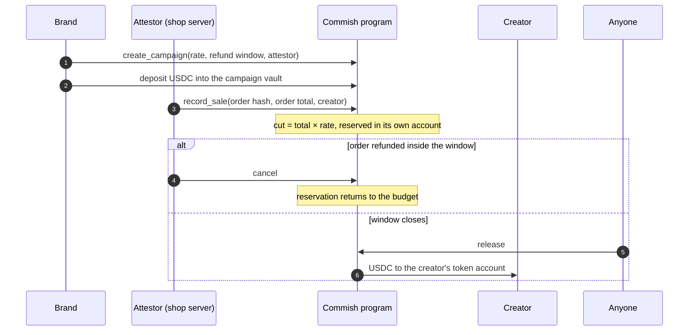

<p align="center">
  
</p>

<p align="center">
  <a href="https://getcommish.vercel.app"><b>getcommish.vercel.app</b></a> ·
  <a href="https://getcommish.vercel.app/en/docs">Docs</a> ·
  <a href="https://explorer.solana.com/address/CmSHpw9QTwvRSNCCBrQz275ESTCw8D79Z8jjhWmPJfFB">Program on Explorer</a> ·
  <a href="pitch/commish-pitch.pdf">Pitch deck</a> ·
  <a href="brag-output/brag.mp4">Launch video</a> ·
  <a href="LICENSE">Apache-2.0</a>
</p>

# Commish

Affiliate commissions that pay themselves, settled in USDC on Solana.

A brand locks a USDC budget in a campaign vault. Each sale a creator refers
reserves that creator's cut in its own on-chain account, where the brand can no
longer spend it. When the refund window closes, anyone can trigger the payout,
and it can only land in the creator's token account. A creator who does not
want to wait can sell the pending commission to a buyer for cash today.

The whole protocol is one Pinocchio program of **9,296 bytes**, small enough to
deploy to mainnet for under 0.05 SOL, with **26 end-to-end tests** that run
against the compiled binary.

| | |
| --- | --- |
| Program | `CmSHpw9QTwvRSNCCBrQz275ESTCw8D79Z8jjhWmPJfFB` |
| Network | Solana mainnet |
| Token | USDC `EPjFWdd5AufqSSqeM2qN1xzybapC8G4wEGGkZwyTDt1v` |
| App | https://getcommish.vercel.app, in English, Bahasa Indonesia, Español and 中文 |

## The problem

- **Creators get paid when it suits the brand.** Net-30 to net-60 payout terms
  are normal, and the clock often starts after the month closes.
- **Nothing protects what was earned.** Until the brand pays, the money is the
  brand's. Programs change terms or shut down, and the creator has no
  independent record of what was owed.
- **Borders cost extra.** Cross-border fees and minimum payout thresholds take
  the biggest share from small creators, often in the markets that are growing
  fastest.

Commish does not try to prove that an off-chain sale happened; nothing on-chain
can. It removes the brand's ability to delay or claw back a commission once the
sale is recorded. Recording becomes a public, binding promise.

## How it works

<p align="center"></p>



1. **Fund.** The brand creates a campaign with a commission rate (up to 50%), a
   refund window (up to 90 days) and an attestor key, then deposits USDC into a
   vault owned by the campaign address.
2. **Record.** When a referred order is paid, the attestor records it. The
   program computes the cut from the campaign rate and reserves it in a
   commission account derived from the order hash.
3. **Hold.** Inside the refund window the attestor can cancel the commission if
   the order is refunded. After the window, it can only be paid.
4. **Release.** Anyone can release a commission that is due. The payout goes to
   the current payee's USDC account, and the account rent returns to whoever
   paid it.

## Guarantees, and the tests that attack them

Every rule is checked by the program and attacked by a test in
[`program/test/commish.test.ts`](program/test/commish.test.ts).

| Guarantee | How the program enforces it | Test |
| --- | --- | --- |
| Owed money stays locked | `withdraw` requires `reserved + amount ≤ vault balance` | the brand can take back only what is not reserved |
| One order, one commission | the commission address is a PDA of `sha256("commish:v1" ‖ campaign ‖ order id)` | the same order can never be recorded twice |
| Only the attestor records sales | the signer must equal `campaign.attestor`; the amount comes from `campaign.bps` | only the campaign's attestor can record a sale |
| No overspending | a sale needs `reserved + cut ≤ vault balance` | a sale cannot reserve more than the unreserved budget |
| Payouts can't be redirected | the destination's owner must be the payee and its mint the campaign mint | the payout cannot be redirected |
| No cross-campaign drains | the commission must belong to the campaign whose vault pays | a commission from another campaign cannot drain this vault |
| Paid exactly once | the commission account is closed in the instruction that pays it | a commission cannot be paid twice |
| No cancelling after the window | `cancel` requires `now < release_at` | once the window has closed the commission is owed and cannot be cancelled |
| Rent goes back to its payer | the rent destination must equal `commission.rent_payer` | the rent goes back to whoever paid it, nobody else |
| Works without this website | `release` needs no signer | pays the creator once the refund window closes, and refunds the rent |

## Early payout

<p align="center"></p>

A pending commission is money owed on a known date. The payee can sell it to a
buyer at an agreed price, at most its face value. `sell` settles in one
transaction: the buyer pays the payee in the campaign's token, and the buyer
becomes the new payee. At release the buyer collects the full amount. The
buyer also takes over the refund risk: if the order is refunded inside the
window, the commission is cancelled and the buyer receives nothing, which is
what the discount prices in.

| | State of one commission |
| --- | --- |
|  | **Held.** 25.00 USDC reserved; the brand cannot withdraw it. |
|  | **Sold early.** The creator receives 24.25 USDC now; the buyer is the payee. |
|  | **Paid.** Released to the buyer when the window closed; the account is closed. |

## The app

<p align="center"></p>

| | |
| --- | --- |
|  |  |
| **Brand console.** Create and fund campaigns, record sales, refund, withdraw what is unreserved. | **Docs.** Accounts, instructions, error codes, integration and the security model. |
|  |  |
| **Four languages, two themes.** | **Built for phones first.** |

- **Brand console** (`/brand`): create a campaign, fund it, record a sale as the
  attestor, refund inside the window, withdraw the unreserved budget, share the
  campaign link with creators.
- **Creator desk** (`/creator`): every commission a wallet is owed across all
  campaigns, what is pending and what is due, one-click release, and a
  referral-link builder.
- **Campaign page** (`/campaign/<address>`): a public, read-only view of a
  campaign's budget, reservations and open commissions.
- Reads go through server routes that query the program's accounts with
  `getProgramAccounts` filters. Browser RPC traffic goes through a proxy that
  only forwards the methods the app needs.

## The program

Written with [Pinocchio](https://github.com/anza-xyz/pinocchio) 0.11, no Anchor,
no heap allocations. The binary is 9,296 bytes, which puts the mainnet deploy
under 0.05 SOL:

| Account | Bytes | Rent (SOL) |
| --- | ---: | ---: |
| Program data (binary + 45-byte header) | 9,341 | 0.04810252 |
| Program account | 36 | 0.00083312 |
| **Total held by the deploy** | | **0.04893564** |

How it stays that small:

- `core` rebuilt with `panic_immediate_abort`, `opt-level = 3`, fat LTO.
- Zero-copy `#[repr(C)]` records read in place; no serialization library.
- A hand-written lazy entrypoint and one CPI helper shared by every call.
- The client passes PDA bumps and rent amounts; the runtime already rejects a
  wrong bump or an account below the rent-exempt minimum.
- Invariant-based arithmetic instead of checked math where the invariant is
  enforced on the way in.

### Accounts

| Account | Seeds | Size | Holds |
| --- | --- | ---: | --- |
| Campaign | `["campaign", brand, id_le]` | 176 | brand, attestor, mint, vault, id, hold, reserved, paid, bps |
| Commission | `["commission", campaign, order_hash]` | 184 | campaign, creator, payee, rent payer, order hash, amount, release time, sold flag |
| Vault | associated token account of the campaign | 165 | the campaign's USDC |

### Instructions and compute

| # | Instruction | Signers | Compute units |
| ---: | --- | --- | ---: |
| 0 | `create_campaign` | brand | 15,109 (with the vault) |
| 1 | `record_sale` | attestor, payer | 1,783 |
| 2 | `cancel` | attestor | 376 |
| 3 | `release` | none | 1,666 |
| 4 | `withdraw` | brand | 1,450 |
| 5 | `sell` | payee, buyer | 1,622 |

Error codes start at 6000 and are listed in the [docs](https://getcommish.vercel.app/en/docs#errors).

## Repository

| Path | What it is |
| --- | --- |
| [`program/`](program) | the on-chain program (`src/lib.rs`) and its LiteSVM test suite |
| [`web/`](web) | the Next.js app: landing, brand console, creator desk, docs, API routes |
| [`web/src/lib/commish/program.ts`](web/src/lib/commish/program.ts) | the client: account decoders, PDA derivation, every instruction builder |
| [`docs/images/`](docs/images) | the screenshots in this file |
| [`pitch/`](pitch) | the pitch deck: PDF, PowerPoint (pixel-exact and editable) and the HTML source with speaker notes |
| [`research/commish-sources.md`](research/commish-sources.md) | every outside number in the deck, with the page it came from and a verbatim quote |
| [`docs/video/`](docs/video) | the product walkthrough, the pitch and walkthrough scripts, and the recording guide |
| [`brag-output/`](brag-output) | the 23-second launch video, its poster and share copy |

The directories `programs/`, `pinocchio/`, `app/`, `runbooks/`, `scripts/` and
`tests/` hold the first iteration of this project (Anchor, then an earlier
Pinocchio port). They are superseded by `program/` and `web/` and are not part
of the deployed product.

## Build and run

Program (needs the Solana CLI with `cargo build-sbf`):

```bash
cd program
npm ci
npm run build   # target/deploy/commish.so, 9,296 bytes
npm test        # 26 tests against the compiled binary
```

App:

```bash
cd web
npm ci
npm run dev     # http://localhost:3000
```

| Variable | Used for | Default |
| --- | --- | --- |
| `RPC_URL` | server-side reads and the RPC proxy | `https://api.mainnet-beta.solana.com` |
| `NEXT_PUBLIC_RPC_URL` | the browser's RPC endpoint | the app's own `/api/rpc` proxy |
| `NEXT_PUBLIC_SITE_URL` | canonical links and share URLs | `https://getcommish.vercel.app` |

## Security model

- The attestor is trusted to report real, paid orders. The program cannot see
  off-chain orders; it guarantees what happens after one is recorded.
- Funds leave a vault only through `release` (to the payee, after the window)
  and `withdraw` (the unreserved part, to the brand).
- Only the legacy SPL Token program is used, and every token account is checked
  against the campaign's mint.
- Order hashes include the campaign address and cannot be predicted without the
  order id, so nobody can pre-create a commission address to block an order.
- The program has not been audited. Keep amounts modest until it is.

## Media

- **Launch video** (23 s): [`brag-output/brag.mp4`](brag-output/brag.mp4), made from the running app.
- **Product walkthrough** (1:39): [`docs/video/commish-walkthrough.mp4`](docs/video/commish-walkthrough.mp4).
- **Pitch deck** (11 slides): [`pitch/commish-pitch.pdf`](pitch/commish-pitch.pdf), [`.pptx`](pitch/commish-pitch.pptx), [editable `.pptx`](pitch/commish-pitch-editable.pptx).

Music in the videos: "Happy Beats / Business Moves" Vol. 10 and Vol. 12 by
Sascha Ende ([ende.app](https://ende.app/en)), CC BY 4.0. Sound effects by
[Kenney](https://kenney.nl/), CC0. Geist fonts by Vercel, SIL Open Font License.

## License

[Apache-2.0](LICENSE)
